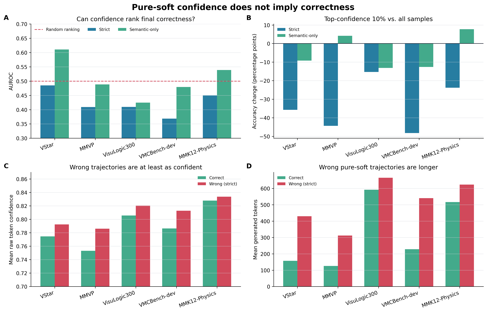
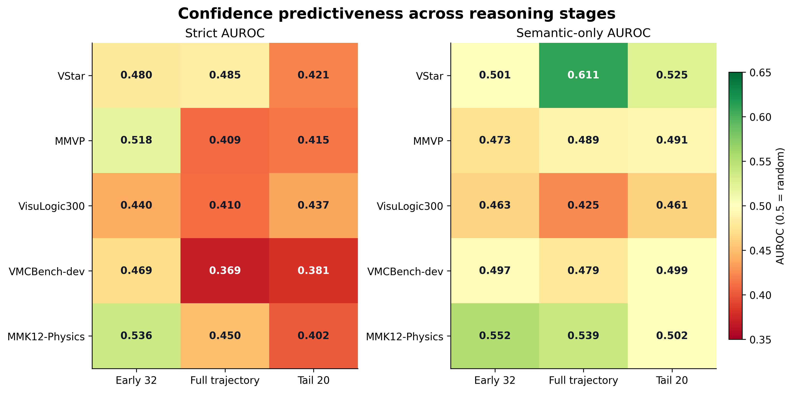
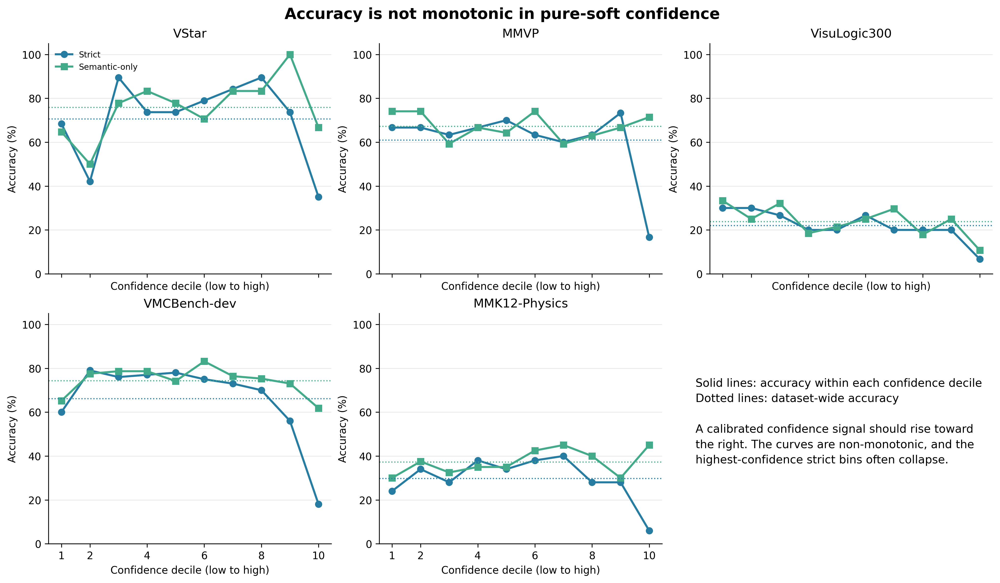
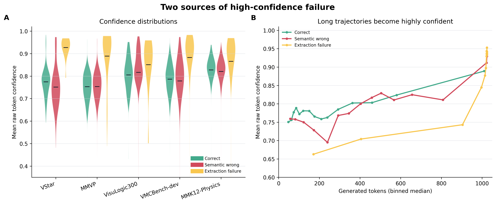
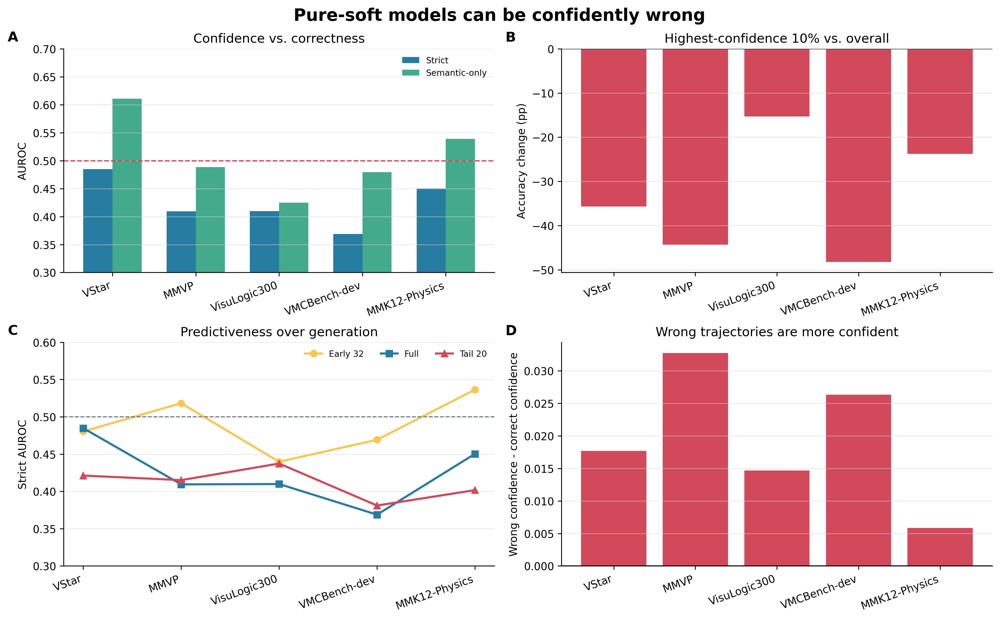

# Pure-Soft 推理中的置信度与正确率分析

## 目录

1. [研究问题](#1-研究问题)
2. [实验对象与统一口径](#2-实验对象与统一口径)
3. [指标定义](#3-指标定义)
4. [总体结果](#4-总体结果)
5. [高置信错误](#5-高置信错误)
6. [推理阶段分析](#6-推理阶段分析)
7. [长度与退化因素](#7-长度与退化因素)
8. [结果解释](#8-结果解释)
9. [结论](#9-结论)

## 1. 研究问题

此前的 pure-soft 实验中，我们观察到部分错题具有低 entropy、高 token confidence 和长输出的特点。这提出了一个关键问题：

> 在多模态模型的 pure-soft 推理中，模型的高 token-level confidence 是否意味着最终答案更可能正确？

如果 confidence 是可靠的正确性信号，那么高置信样本应当拥有更高准确率，confidence 排序最终答案时应当取得高于 0.5 的 AUROC，并且置信度十分位中的准确率应当总体单调上升。

本次分析的目标不是证明“所有错误都更自信”，而是检验 token confidence 是否能够跨数据集稳定地代表最终答案正确性，并寻找高置信错误的具体表现。

## 2. 实验对象与统一口径

本报告只分析 `pure_soft` 方法，不混入 COT、LEAD、format2、guard 或 quota 方法。数据来自已经完成的统一 greedy 实验，因此没有重新采样引入的额外差异。

| 项目 | 配置 |
|---|---|
| 模型 | R1-Onevision-7B-RL |
| 方法 | pure-soft |
| 采样 | greedy，`do_sample=False` |
| seed | 42 |
| 最大生成长度 | 1024 tokens |
| 数据集 | VStar、MMVP、VisuLogic300、VMCBench-dev、MMK12-Physics |
| 样本数 | 2291 |
| 严格口径 failed extraction | 274 |

### 置信度字段

分析使用每个生成 token 在过滤前完整词表分布中的 `raw_selected_prob`，即模型实际选择 token 的原始概率。对于 greedy pure-soft 生成，它可以看作 raw top-1 probability。

不能使用过滤后的 `selected_prob` 作为主置信度，因为经过 top-k/top-p 过滤后，概率会被重新归一化，容易接近 1，不能反映模型在完整词表上的真实不确定性。

## 3. 指标定义

### Strict accuracy

答案抽取失败也计为错误。这个指标反映一条推理轨迹最终是否产生了可用且正确的答案。

### Semantic-only accuracy

排除答案抽取失败，只比较能够成功抽取答案的样本。这个指标用来区分“语义判断错误”和“输出格式导致无法评测”。

### Confidence AUROC

用样本平均 raw token confidence 对最终正确/错误排序：

- AUROC = 0.5：confidence 与正确性没有排序关系；
- AUROC > 0.5：高 confidence 更可能正确；
- AUROC < 0.5：错误样本反而更可能高 confidence。

### Top-decile delta

最高置信 10% 样本准确率减去总体准确率。如果 confidence 可靠，该值应当为正。

### Early32 与 Tail20

- `Early32`：生成前 32 个 token 的平均 confidence；
- `Tail20`：最后 20 个 token 的平均 confidence。

这两个指标用于判断高置信错误是在推理开头已经出现，还是在后续展开中逐渐锁定。

## 4. 总体结果



### 4.1 Strict 口径

| 数据集 | Strict accuracy | failed extraction | Mean-confidence AUROC | 最高置信10% delta | 错误置信度 - 正确置信度 |
|---|---:|---:|---:|---:|---:|
| VStar | 70.68% | 13 | 0.485 | -35.68pp | +0.0177 |
| MMVP | 61.00% | 28 | 0.409 | -44.33pp | +0.0327 |
| VisuLogic300 | 22.00% | 23 | 0.410 | -15.33pp | +0.0147 |
| VMCBench-dev | 66.20% | 110 | 0.369 | -48.20pp | +0.0263 |
| MMK12-Physics | 29.80% | 100 | 0.450 | -23.80pp | +0.0058 |

五个数据集的 strict AUROC 全部低于 0.5。MMVP、VisuLogic300 和 VMCBench-dev 的 95% bootstrap 置信区间上界也低于 0.5，说明高 confidence 在这些数据集上不是简单的“没有帮助”，而是明显偏向错误样本。

最高置信 10% 的准确率比总体准确率低 15.33–48.20 个百分点。换句话说，在 strict 口径下，直接选择最高 confidence 的样本，反而会选择到一批风险更高的样本。

### 4.2 排除抽取失败后的语义口径

| 数据集 | Semantic accuracy | Semantic-only AUROC | 最高置信10% delta |
|---|---:|---:|---:|
| VStar | 75.84% | 0.611 | -9.18pp |
| MMVP | 67.28% | 0.489 | +4.15pp |
| VisuLogic300 | 23.83% | 0.425 | -13.11pp |
| VMCBench-dev | 74.38% | 0.479 | -12.58pp |
| MMK12-Physics | 37.25% | 0.539 | +7.75pp |

排除抽取失败后，四个数据集的 AUROC 仍不超过 0.55。VisuLogic300 仍明显呈反向关系，MMVP 和 VMCBench-dev 基本没有预测能力。

VStar 是重要反例：semantic-only AUROC 为 0.611，说明在答案能够正常抽取的 VStar 样本中，confidence 有一定正相关。因此不能把结论夸大成“错误答案在所有数据集上都更自信”。更准确的结论是：token confidence 缺乏跨数据集可靠校准，并且在多个数据集上会系统性地产生高置信错误。



## 5. 高置信错误

### 5.1 阈值统计

| 数据集 | Mean confidence >= 0.90：strict / semantic | Tail20 confidence >= 0.95：strict / semantic |
|---|---:|---:|
| VStar | 36.00% / 64.29% | 52.17% / 70.59% |
| MMVP | 11.11% / 50.00% | 13.79% / 57.14% |
| VisuLogic300 | 14.93% / 17.86% | 17.24% / 20.83% |
| VMCBench-dev | 22.76% / 54.90% | 40.87% / 69.63% |
| MMK12-Physics | 11.90% / 40.00% | 18.50% / 35.16% |

MMVP 的 mean confidence >= 0.90 样本中，strict accuracy 只有 11.11%；排除抽取失败后，6 条可抽取样本也只有 50% 正确。VMCBench-dev 同一阈值组的 strict accuracy 只有 22.76%，semantic accuracy 为 54.90%。

### 5.2 代表性样本

以下样本均成功抽取了答案，因此不是单纯的格式失败：

| 数据集 | 样本 | 预测 / gold | Mean conf | Early32 | Tail20 | 输出长度 |
|---|---|---|---:|---:|---:|---:|
| VStar | 158 | A / B | 0.9722 | 0.9359 | 0.9996 | 1024 |
| VStar | 27 | D / B | 0.9746 | 0.5190 | 1.0000 | 1024 |
| MMVP | 263 | A / B | 0.9676 | 0.6512 | 0.9996 | 1023 |
| MMVP | 104 | B / A | 0.9617 | 0.7224 | 0.9996 | 1023 |
| VisuLogic300 | 16 | D / C | 0.9778 | 0.7716 | 1.0000 | 1024 |
| VMCBench-dev | 7861 | A / B | 0.9749 | 0.6015 | 1.0000 | 1023 |
| MMK12-Physics | 9369f77e | D / B | 0.9515 | 0.8749 | 1.0000 | 1024 |

VStar 样本 158 是一个较干净的例子：在前 32 个 token 时 confidence 已经达到 0.9359，整段平均为 0.9722，最后 20 个 token 达到 0.9996，但最终答案仍然错误。这说明高 confidence 可以表示“模型已经坚定地沿着一条轨迹继续生成”，而不表示这条轨迹与图像事实或 gold answer 一致。



## 6. 推理阶段分析

| 数据集 | Early32 strict / semantic | Full strict / semantic | Tail20 strict / semantic |
|---|---:|---:|---:|
| VStar | 0.480 / 0.501 | 0.485 / 0.611 | 0.421 / 0.525 |
| MMVP | 0.518 / 0.473 | 0.409 / 0.489 | 0.415 / 0.491 |
| VisuLogic300 | 0.440 / 0.463 | 0.410 / 0.425 | 0.437 / 0.461 |
| VMCBench-dev | 0.469 / 0.497 | 0.369 / 0.479 | 0.381 / 0.499 |
| MMK12-Physics | 0.536 / 0.552 | 0.450 / 0.539 | 0.402 / 0.502 |

Early32 strict AUROC 位于 0.440–0.536，基本接近随机。这说明单靠最开始的 token confidence，无法可靠判断最终答案是否正确。

Tail20 strict AUROC 降至 0.381–0.437。错误轨迹在后续展开中往往变得越来越确定，尾部高 confidence 更像是轨迹已经锁定的表现，而不是模型重新确认了视觉事实。

这一现象与 early trajectory commitment 假设相容：模型可能在早期选择了错误方向，随后 pure-soft 生成不断强化已有方向，最终形成低 entropy、高 confidence 的错误答案。

## 7. 长度与退化因素

| 数据集 | 正确样本平均长度 | 错误样本平均长度 | 原始 AUROC | 长度分层 AUROC |
|---|---:|---:|---:|---:|
| VStar | 157.4 | 429.9 | 0.485 | 0.546 |
| MMVP | 126.0 | 311.5 | 0.409 | 0.454 |
| VisuLogic300 | 591.7 | 665.1 | 0.410 | 0.457 |
| VMCBench-dev | 227.9 | 539.9 | 0.369 | 0.503 |
| MMK12-Physics | 516.1 | 623.1 | 0.450 | 0.496 |

五个数据集的错误样本平均都更长。长度分层后，VMCBench-dev 的强反向关系基本消失，说明它很大程度上受到长输出、重复和抽取失败的放大；MMVP 和 VisuLogic300 仍保留一定反向趋势，说明其中存在不依赖长度的高置信语义错误。

因此，高置信错误至少包含两类：

1. **语义错误型**：输出格式正常，但模型对视觉属性、空间关系、选项映射或事实判断做出了错误决定，并以高 confidence 继续推理。
2. **生成退化型**：pure-soft 轨迹变长、重复或接近最大长度，后部 token distribution 收缩，产生极高 confidence，但最终答案不可用或错误。





## 8. 结果解释

本实验支持以下机制解释：

```text
视觉输入 / 问题
       |
       v
早期选择一条 latent trajectory
       |
       +--> 正确轨迹：confidence 收缩，答案正确
       |
       +--> 错误轨迹：继续 self-reinforce，confidence 同样收缩
                              |
                              +--> 正常格式但语义错误
                              +--> 长输出 / 重复 / 抽取失败
```

这里的关键不是模型“不知道自己在做什么”，而是 token confidence 只反映当前生成分布对下一 token 的集中程度。它没有直接衡量：

- 视觉证据是否被正确读取；
- 当前 latent trajectory 是否与图像事实一致；
- 当前候选答案是否经过了独立的反事实验证；
- 最终答案格式是否仍然可被评测器抽取。

因此，soft 推理中的低 entropy 可能表示“内部状态已经稳定”，但不一定表示“内部状态是正确的”。

## 9. 结论

1. **纯 soft 推理会出现高置信错误。** 五个数据集的 strict confidence AUROC 全部低于 0.5，最高置信 10% 的准确率反而显著下降。

2. **这个现象不完全是答案抽取失败造成的。** 排除 failed extraction 后，VisuLogic300 仍有明显反向关系，MMVP 和 VMCBench-dev 的 confidence 也基本没有语义预测力。

3. **错误轨迹往往在后期变得更加确定。** Tail20 的严格 AUROC 普遍低于 Early32，说明错误路径会在生成过程中逐步锁定。

4. **长度和生成退化会放大问题，但不是唯一原因。** 长输出解释了部分 strict 反向关系，但无法解释所有高置信语义错题。

5. **不能把结论写成“confidence 永远与正确率反向”。** VStar semantic-only AUROC 为 0.611，MMK12-Physics 为 0.539。更严谨的表述是：

> Pure-soft token-level confidence is not a reliably calibrated signal of final multimodal correctness. A model may become highly confident after committing to an incorrect reasoning trajectory.

### 方法学边界

本报告中的 confidence 是 token 分布集中度，不是模型显式报告的最终答案置信度。该结果证明了“高 token confidence 不保证正确”，但不能单独证明每一个错误都是由某个特定 latent intervention 造成的。若要建立反事实因果结论，还需要进一步对 fixed/damaged 样本进行事件级 trace 和 branch replay。

